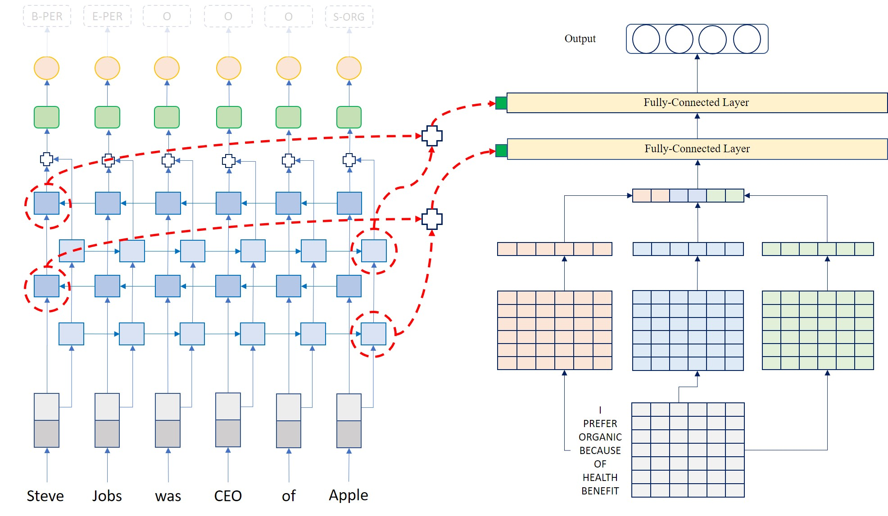

# Neural Transfer Learning for Natural Language Processing

#### **UPDATE: Work in Progress to improve the code quality. Thank you for your understanding**

The Master Thesis implements Progressive Neural Networks (PNN) for the Transfer 
Learning between Named Entity Recognition (NER) and Text Classification 
(Sentiment Analysis). The PNNs are compared with the standard pre-training/fine-tuning (PTFT)
technique of Transfer Learning in which a pre-trained network is fine-tuned on a 
target task/data.

This work has been accepted at LREC2020 conference. The paper can be found here: https://www.aclweb.org/anthology/2020.lrec-1.172/

Comprehensive information regarding this work can be found in the defense presented for this Thesis in Documents/ folder.

## Background

More information about Transfer Learning, PNN, NER and text classification can be 
found in the following:
1. PNN: https://arxiv.org/abs/1606.04671
2. NER: https://arxiv.org/abs/1603.01354
3. TC: https://www.aclweb.org/anthology/D14-1181
4. Transfer Learning: http://ruder.io/thesis/

## Overview

Below is the overview of the files:
1. src: This directory contains the source code
2. src/ner: contains the code for Named Entity Recognition
3. src/ner/data/: processed dataset after running SL notebooks on the raw datasets to convert them into ‘Sentence →Label’ format. A dummy dataset has been uploaded. The dataset contains three folders: Train, Val and Test for the respective phase. The folder is enriched with additional information after the build_vocab.py is run. The additional information contains the JSON files to map the indices of the words and the characters to their respective embedding matrices.
4. src/ner/embeddings/: contains the pre-trained word embeddings (raw .txt or .vec) files.
5. src/ner/experiments/: folder for each experiment. An experiment contains the following files and folders:
6. src/ner/experiments/<experiment_name>/plots: contains graphs and metrics over the epochs stored in the PKL, JSON and PNG formats
7. src/ner/experiments/<experiment_name>/best.pth: the Pytorch model for the best prediction on validation set obtained so far
8. src/ner/experiments/<experiment_name>/data_encoder.pkl: data encoder pickled
9. src/ner/experiments/<experiment_name>/label_encoder.pkl: label encoder pickled
10. src/ner/experiments/<experiment_name>/last.pth: Pytorch model for the last prediction on the validation set
11. src/ner/experiments/<experiment_name>/params.json: hyperparameters for the network
12. src/ner/experiments/<experiment_name>/train.log: logs during the training loop
13. src/ner/experiments/<experiment_name>/train_snapshot.json: snapshot of the train_new.py at the time of the training to facilitate reproducibility.
14. src/ner/data.py: iterators for various kinds of the data formats. Currently supports reading from CoNLL03 format and raw string.src/ner/encoder.py: encoding the data into indices and numericssrc/ner/evaluate.py: evaluating for validation and test datasets. Generates the metrics
15. src/ner/evaluation.py: function definitions of various metrics
16. src/ner/train_new.py: the training loop
17. src/ner/utils.py: utils such as pickling, saving and reading text files, etc.
18. src/tc: contains the code for Text Classification. The directory structure is similar to the NER.
19. src/booster: Contains the code for Transfer Learning using PNNs and PTFT
20. src/booster/algorithms/: Transfer Learning algorithms. Currently only fine_tune.ipynb which performs the standard PTFT algorithm.
21. src/booster/future/: Code for future work
22. src/booster/progNN: Progressive Neural Networks
23. src/booster/progNN/adapter.py: Read the PNN paper for more details
24. src/booster/progNN/column_ner.py: Fitting a Neural Network to the ‘Column’. Read PNN paper on information about the Column. This column is specific to NER
25. src/booster/progNN/column_tc.py: Fitting a Neural Network to the ‘Column’. Read PNN paper on information about the Column. This column is specific to TC
26. src/booster/progNN/decoder.py: Conditional Random Field (CRF) module for Sequence Decoding
27. src/booster/progNN/net.py: Neural Network with modifications for PNN, for NER
28. src/booster/progNN/prognet.py: General PNN framework
29. src/booster/progressive_<build_vocab><data><data_loader><encoder><evaluate>: same intention as the counterparts in NER and TC folders, but with modifications for the PNN framework.
30. src/booster/progressive_ner.py: PNN for NER
31. src/booster/progressive_ner_3col.py: PNN for NER as target task with 2 source columns. The source columns can be NER for the same-task transfer, or TC for cross-task transfer.
32. src/booster/progressive_tc.py: TC counterpart for the progressive_ner.py
33. src/booster/progressive_tc_3col.py: TC counterpart for progressive_ner_3col.py. The source columns could either be NER or TC.
34. src/booster/utils.py: same as utils in NER/
35. src/notebooks: Contains Jupyter notebooks
36. src/notebooks/data_exploration: statistics about the NER and Sentiment Analysis (SA) datasets
37. src/notebooks/data_preparation: preparing the data for processing
38. src/notebooks/data_preparation/SL: converting data into a ‘Sentence → Label’ format. The dummy files for this format are available under src/ner/data/dummy folder
39. src/notebooks/data_preparation/split: splitting the data into 10 portions of varying sizes; starts from 10% of complete dataset to 100% dataset for training. This is to mimic the varying availability of the training dataset in 10% increments.
40. src/notebooks/graphs: notebooks to create graphs from the experiments
41. src/notebooks/named_entity_recognition: Jupyter notebooks to run the complete pipeline
42. src/notebooks/named_entity_recognition/evaluate.ipynb: evaluation on validation and test set
43. src/notebooks/named_entity_recognition/feat.ipynb: creating features from the training datasets
44. src/notebooks/named_entity_recognition/fine_tune.ipynb: PTFT for NER
45. src/notebooks/named_entity_recognition/inference.ipynb: obtain predictions for the input sentences using pre-trained model
46. src/notebooks/named_entity_recognition/progressive_2col.ipynb: PNN with 1 source column and 1 target column
47. src/notebooks/named_entity_recognition/progressive_3col.ipynb: PNN with 2 source columns and 1 target column
48. src/notebooks/named_entity_recognition/train.ipynb: training loop
49. src/notebooks/text_classification: Jupyter notebooks to run complete pipeline for Sentiment Analysis. The sub-notebooks are similar to NER.
50. src/resources: This directory contains the raw datasets for NER and Sentiment Analysis
51. Documents/: contains the defense
52. Resources/: contains the raw datasets used in this work

## Reproducibility
Below are the instructions to run the experiments. The instructions are general and not supported with the commands to allow for more flexibility.
The methods listed below specify the general pipeline to follow to reproduce an experiment. The reader is expected to run the notebooks provided to get a gist of the pipeline.

### Named Entity Recognition Single-Task:
1. Download the raw dataset with train, validation and test splits
2. Run the ‘sentence→label’ converter in src/notebooks/data_preparation folder. There are Jupyter notebooks for various datasets. The notebooks convert the CoNLL03 format into SL format. The resulting datasets will be saved in the NER/data folder.
3. Download the 6B tokens English embeddings from http://nlp.stanford.edu/data/glove.6B.zip and place the .txt file in NER/embeddings/ folder. The dimensionality depends upon the use-case
4. Run the progressive_build_vocab.py in src/booster folder. In the script, the following parameters should be changed:    
    --data_folder: the path to the SL format datasets    
    --embeddings_folder: the path to the embeddings in the src/ner/embeddings/ directory.    
    --embeddings_dim: the dimensionality of the embeddings    
    --embeddings_type: type of embeddings. Supported: GloVe, Word2vec and Fasttext    
The features are saved in the data folder.
5. Run the train_new.py in src/ner/ directory. This trains the neural network and saves the model. The following parameters can be changed:    
    --data_dir: directory of the SL format data, enriched by progressive_build_vocab.py    
    --model_dir: directory to save the model.    
    --restore_file: file to restore model from    
6. The evaluation can be done using the evaluate.py

### Text Classification Single-Task
1. Download the raw dataset with train, validation and test splits
2. Run the ‘sentence→label’ converter in src/notebooks/data_preparation/SL/text_classification folder. There are Jupyter notebooks for various datasets. The notebooks convert the ‘label_whitespace_text’ format to the SL format.
3. Download the 6B tokens English embeddings from http://nlp.stanford.edu/data/glove.6B.zip and place the .txt file in TC/embeddings/ folder. The dimensionality depends upon the use-case
4. Run the build_vocab.py in src/tc folder. In the script, the following parameters should be changed:  
    --data_folder: the path to the SL format datasets  
    --embeddings_folder: the path to the embeddings in the src/ner/embeddings/ directory.  
    --embeddings_dim: the dimensionality of the embeddings  (100 for Text Classification)
    --embeddings_type: type of embeddings. Supported: GloVe, Word2vec and Fasttext  ('glove' for Text Classification)
The features are saved in the data folder.
5. Run the train.py in src/tc/ directory. This trains the neural network and saves the model. The following parameters can be changed:  
    --data_dir: directory of the SL format data, enriched by progressive_build_vocab.py  
    --model_dir: directory to save the model.  
    --restore_file: file to restore model from  
6. The evaluation can be done using the src/tc/evaluate.py

### Pre-training/Fine-Tuning
A pre-trained network is fine-tuned on a target dataset. The target task must be identical to the source task.

#### Named Entity Recognition:
1. Follow the steps 1-4 for the Named Entity Recognition Single-Task setting.
2. Run the src/booster/algorithms/fine_tune.py with the following parameters:  
    --data_dir: directory of the SL format data, enriched by progressive_build_vocab.py  
    --model_dir: directory to save the model.  
    --pretrained_model_dir: The pre-trained model (experiment directory to be specified) from which the knowledge will be transferred.  
    --all_layer: True or False. Whether to fine-tune all the layers or only the last layer.  
3. Evaluation can be done the same way as for NER for Single-Task

#### Text Classification
1. Follow the steps 1-4 for the Text Classification Single-Task setting
2. run src/tc/train_ptft.py with the following parameters:  
    --data_dir: directory of the SL format data, enriched by progressive_build_vocab.py  
    --model_dir: directory to save the model.  
    --pretrained_model_dir: The pre-trained model (experiment directory to be specified) from which the knowledge will be transferred.  
    --all_layer: True or False. Whether to fine-tune all the layers or only the last layer.  
3. Evaluation can be done the same way as for TC for Single-Task

### Progressive Transfer: 
The same-task and cross-task transfer using the Progressive Neural Networks

#### NER → NER or TC → NER
1. Follow the steps 1-4 of NER for single-Task setting
2. Run src/booster/progressive_ner.py with the following parameters:  
    --data_dir: directory of the SL format data, enriched by progressive_build_vocab.py  
    --model_dir: directory to save the model.  
    --freeze_prev: Boolean. Whether to freeze the source column or not  
    --best_prev: Boolen. Whether to use the optimized source column or random source column  
    --linear_adapter: Boolean. True if linear adapter, False if non-linear  
    --best_target: Boolean. Whether to load the optimized target column model before the progressive transfer.  
    --pretrained_model_dir: The pre-trained model (experiment directory to be specified) from which the knowledge will be transferred.   
3. The option to use NER or TC as a source column is explained in the script.
4. The evaluation on test set is done while training and logged inside the ‘plots’ directory of the experiment folder.

#### TC → TC or NER → TC
1. Follow the steps 1-4 of TC for single-Task setting
2. Run src/booster/progressive_tc.py with the following parameters:   
    --data_dir: directory of the SL format data, enriched by progressive_build_vocab.py  
    --model_dir: directory to save the model.  
    --freeze_prev: Boolean. Whether to freeze the source column or not  
    --best_prev: Boolen. Whether to use the optimized source column or random source column  
    --linear_adapter: Boolean. True if linear adapter, False if non-linear  
    --best_target: Boolean. Whether to load the optimized target column model before the progressive transfer.  
    --pretrained_model_dir: The pre-trained model (experiment directory to be specified) from which the knowledge will be transferred.  
3. The option to use NER or TC as a source column is explained in the script.
4. The evaluation on test set is done while training and logged inside the ‘plots’ directory of the experiment folder.

#### [TC, TC] → NER or [NER, NER] → NER
1. Follow the steps 1-4 of NER for single-Task setting
2. Run src/booster/progressive_ner_3col.py with the following parameters:  
    --data_dir: directory of the SL format data, enriched by progressive_build_vocab.py  
    --model_dir: directory to save the model.  
    --freeze_prev: Boolean. Whether to freeze the source column or not  
    --best_prev: Boolen. Whether to use the optimized source column or random source column  
    --linear_adapter: Boolean. True if linear adapter, False if non-linear  
    --best_target: Boolean. Whether to load the optimized target column model before the progressive transfer.    
    --c1_model_dir: The pre-trained model (experiment directory to be specified) from which the knowledge will be transferred, for the 1st source column.  
    --c2_model_dir: The pre-trained model (experiment directory to be specified) from which the knowledge will be transferred, for the 2nd source column.  
3. The option to use NER or TC as a source column is explained in the script.
4. The evaluation on test set is done while training and logged inside the ‘plots’ directory of the experiment folder.

#### [TC, TC] → NER or [NER, NER] → NER
1. Follow the steps 1-4 of TC for single-Task setting
2. Run src/booster/progressive_tc_3col.py with the following parameters:  
    --data_dir: directory of the SL format data, enriched by progressive_build_vocab.py  
    --model_dir: directory to save the model.  
    --freeze_prev: Boolean. Whether to freeze the source column or not  
    --best_prev: Boolen. Whether to use the optimized source column or random source column  
    --linear_adapter: Boolean. True if linear adapter, False if non-linear  
    --best_target: Boolean. Whether to load the optimized target column model before the progressive transfer.  
    --c1_model_dir: The pre-trained model (experiment directory to be specified) from which the knowledge will be transferred, for the 1st source column.  
    --c2_model_dir: The pre-trained model (experiment directory to be specified) from which the knowledge will be transferred, for the 2nd source column.  
3. The option to use NER or TC as a source column is explained in the script.
4. The evaluation on test set is done while training and logged inside the ‘plots’ directory of the experiment folder.